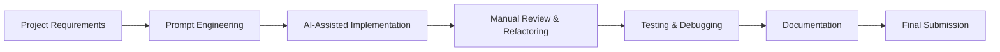

# AI_USAGE

## AI Development Workflow

The project followed an iterative AI-assisted development process. AI was used to accelerate implementation while maintaining manual engineering review and decision-making throughout development.

## AI Usage Overview

This project was developed with assistance from AI-powered engineering tools used as development assistants during implementation. AI was used to accelerate project planning, code generation, documentation drafting, debugging, refactoring support, and design validation.

AI assistance was used to improve development speed and help structure the work, but it was not treated as a substitute for engineering judgment. All important implementation decisions, code review, testing, and final integration were handled manually.

## AI Tools Used

### Perplexity AI
Perplexity AI was used as the primary development assistant for:
- implementation planning,
- backend generation support,
- frontend generation support,
- architecture discussions,
- documentation drafting,
- requirement validation,
- code explanation,
- debugging support,
- prompt refinement.

### ChatGPT
ChatGPT was used for:
- architecture review,
- documentation improvement,
- UI and UX feedback,
- prompt engineering support,
- code explanation,
- refinement of implementation ideas,
- review of design decisions.

Only the AI tools actually used during development are listed above.

## How AI Was Used

AI assistance supported multiple stages of development across the project lifecycle.

### Project Planning
AI helped break the project into feature modules and identify the major building blocks required for a full-stack code review assistant.

### Folder Structure
AI was used to shape the frontend and backend folder organization into feature-based modules that were easier to maintain.

### NestJS Architecture
AI assisted with structuring the backend into modules, controllers, services, DTOs, and guards.

### Next.js Architecture
AI helped organize the frontend into route groups, reusable feature components, and shared utility layers.

### Database Schema
AI supported the initial Prisma schema design and refinement of relationships between users, projects, files, reviews, chat sessions, messages, and AI provider records.

### Prisma Modeling
AI helped validate the model relationships, indexes, enum usage, and ownership boundaries in the schema.

### API Design
AI assisted in shaping the REST endpoint structure for authentication, projects, files, reviews, chat, and AI provider management.

### React Components
AI helped scaffold the overall component structure for auth, projects, files, reviews, chat, landing pages, and AI provider screens.

### Tailwind Styling
AI contributed to early UI layout ideas and component structure that were later refined manually.

### Authentication
AI assisted with planning JWT-based authentication flow, protected endpoints, and user-scoped access patterns.

### AI Provider Abstraction
AI was used to reason about a provider-agnostic configuration model so the application could support OpenAI-compatible endpoints in a flexible way.

### Documentation
AI was used to draft and refine supporting documents such as `README.md`, `ARCHITECTURE.md`, and this `AI_USAGE.md`.

### Debugging and Refactoring
AI was used as a debugging aid when resolving implementation details, improving code clarity, and identifying opportunities for simplification or refactoring.

## Prompt Engineering Approach

The development workflow used focused prompt categories rather than one-off ad hoc prompts.

### Architecture Planning
Prompts were used to define the overall system shape, module boundaries, and project decomposition.

### Feature Implementation
Prompts were used to scaffold major features such as authentication, project management, file upload, reviews, chat, and AI provider handling.

### Backend Module Generation
Prompts were used to generate or refine NestJS modules, controllers, services, and DTOs.

### Frontend Component Generation
Prompts were used to scaffold React and Next.js UI sections and page-level structure.

### Database Design
Prompts were used to refine the Prisma schema and confirm relationships and indexes.

### Documentation Generation
Prompts were used to draft and improve technical documentation in a structured and consistent format.

### Bug Fixing
Prompts were used to investigate errors, explain failures, and suggest likely corrections.

### Refactoring
Prompts were used to simplify code structure, improve readability, and align implementation with the intended architecture.

## AI Generated Code

AI assistance was used to scaffold early versions of several project areas, including:
- initial React component structures,
- NestJS module scaffolding,
- controllers,
- services,
- DTO drafts,
- Prisma schema drafts,
- Tailwind-based layout ideas,
- documentation drafts.

These outputs were used as starting points only. They were not accepted without review or modification.

## Manual Development

The generated output was manually reviewed and refined before being merged into the project.

Manual development included:
- reviewing AI-generated code for correctness,
- refactoring for maintainability,
- integrating separate modules into a working application,
- writing and adjusting custom business logic,
- improving validation and error handling,
- connecting frontend and backend APIs,
- refining UI behavior and layout,
- adjusting database models and relationships,
- testing functionality and fixing defects,
- ensuring that ownership and security checks were correctly enforced.

AI-generated code was never used blindly. Every important part of the implementation was checked, understood, and adapted to the needs of the project.

## Engineering Decisions

Several key engineering decisions were made during development to keep the project practical, maintainable, and aligned with the assessment requirements.

### Next.js for Frontend
Next.js was selected for the frontend because it provides a strong structure for routing, component organization, and production-ready React development.

### NestJS for Backend
NestJS was selected for the backend because it supports modular architecture, dependency injection, and clean separation of controllers and services.

### PostgreSQL with Prisma
PostgreSQL and Prisma were used to provide a relational data model with strong schema control, migrations, and type-safe database access.

### JWT Authentication
JWT authentication was used to support stateless protected routes and user-scoped access control.

### Feature-Based Architecture
A feature-based structure was used across the frontend and backend to keep the codebase organized and easier to scale.

### Provider-Agnostic AI Integration
The AI provider layer was designed to be flexible rather than tied to one vendor, making it easier to support different OpenAI-compatible endpoints.

### User-Owned AI Provider Configuration
AI provider credentials were stored per user so each user could manage their own configuration independently.

### Server-Side ZIP Extraction
ZIP files were processed on the backend so the application could validate, extract, and persist file contents in a controlled way.

### Persistent Review History
Review results were stored in the database so users could revisit prior analyses instead of treating reviews as one-time responses.

### AI Chat with Project Context
Chat sessions were designed around project context and stored message history so conversations could remain useful across multiple turns.

## Validation and Testing

All AI-assisted implementations were manually reviewed before being accepted into the project. Functionality was validated through development-time debugging, iterative refinement, and verification of the major backend and frontend flows.

Testing and review focused on:
- authentication behavior,
- project ownership boundaries,
- upload handling,
- database relationships,
- provider configuration handling,
- review persistence,
- chat session persistence,
- frontend-backend integration.

Where AI suggestions were incomplete or not aligned with the implementation goals, they were corrected manually.

## AI Usage Declaration

This project was developed with assistance from AI-powered engineering tools. AI was used to accelerate development, improve productivity, and assist with documentation and debugging. All generated code was manually reviewed, understood, tested, and modified where necessary before submission. Final engineering decisions and responsibility for the submitted implementation remain with the developer.