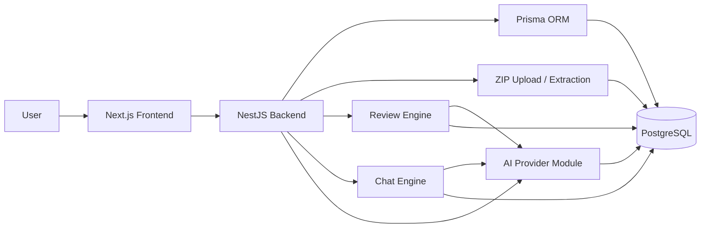
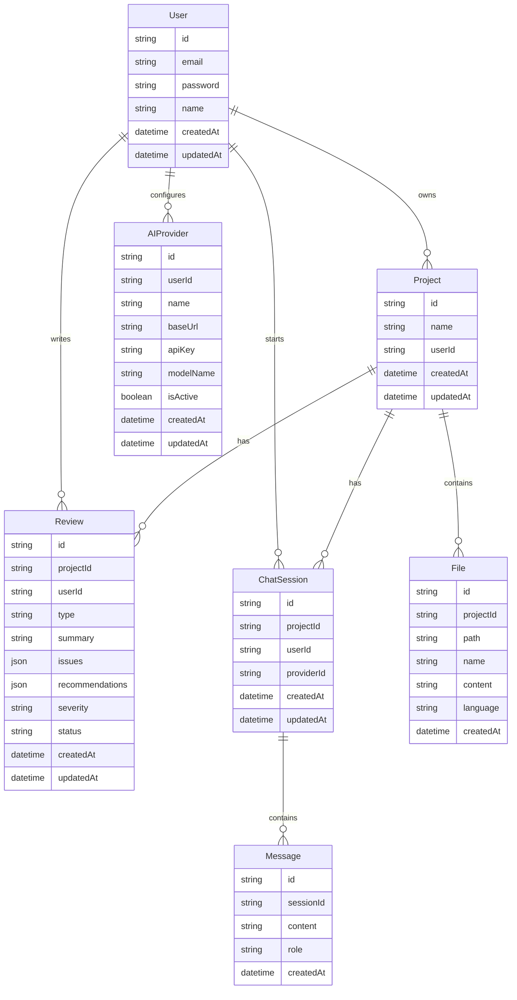
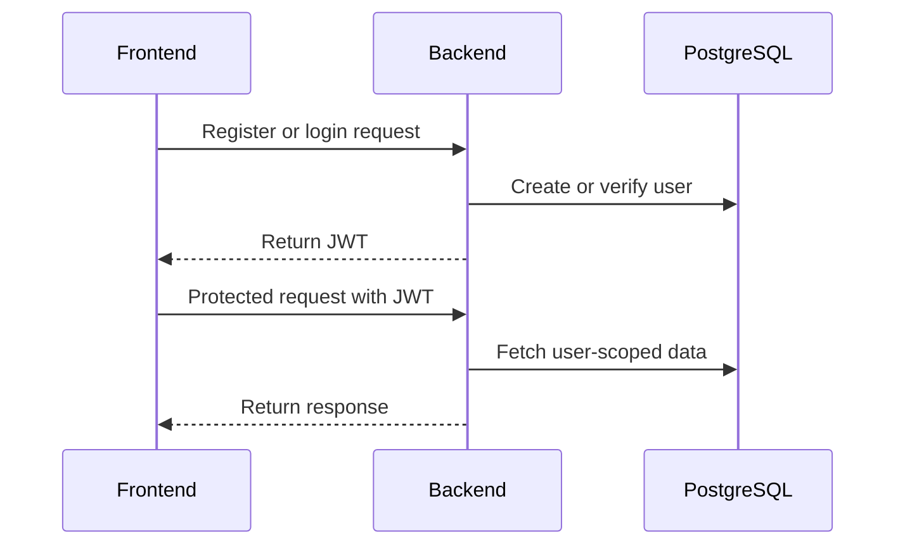
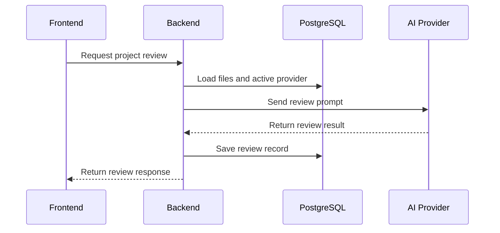
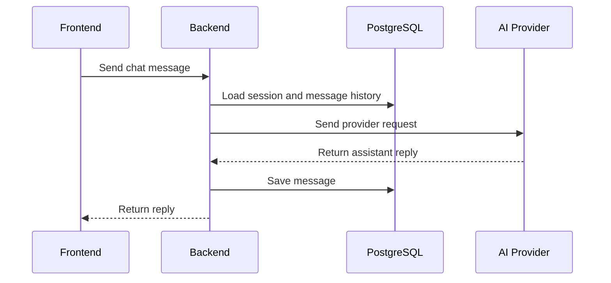

# ARCHITECTURE

## Overview

This application is a full-stack AI-powered code review system built with a Next.js frontend, a NestJS backend, Prisma ORM, and PostgreSQL. The frontend handles authentication, project management, file browsing, reviews, chat, and AI provider configuration. The backend handles JWT authentication, project ownership, ZIP upload and extraction, file persistence, review generation, chat sessions, and AI provider CRUD.

The system is designed around user ownership. Each authenticated user owns their projects, files, reviews, chat sessions, messages, and AI provider configurations. Every protected backend route scopes data to the current user.

The AI layer is provider-agnostic. Users can create their own provider entries with a base URL, API key, model name, and active state. This lets the application work with OpenAI-compatible providers without changing the core application logic.

## Frontend Architecture

The frontend uses the Next.js App Router structure.

### Route Areas
- `app/page.tsx` for the landing page.
- `app/auth/` for authentication views.
- `app/projects/` for the project dashboard.
- `app/layout.tsx` for the global application layout.
- `app/globals.css` for global styles.

### Feature Components
- `components/auth/` for login and registration UI.
- `components/projects/` for project creation and listing.
- `components/files/` for upload, tree, and file preview UI.
- `components/reviews/` for review trigger and history UI.
- `components/chat/` for chat UI.
- `components/ai-providers/` for provider management UI.
- `components/landing/` for landing-page sections.

### Frontend Data Flow
The frontend uses React Query for server state and Axios for API requests. After login, it sends the JWT with protected requests, loads projects, then loads files, reviews, and chat sessions for the selected project.

## Backend Architecture

The backend is a NestJS API organized by feature modules.

### Modules
- `AuthModule`
- `ProjectsModule`
- `FilesModule`
- `AiProvidersModule`
- `ReviewsModule`
- `ChatModule`

### Controllers
The backend exposes REST endpoints for:
- authentication,
- projects,
- files,
- reviews,
- chat,
- AI providers.

### Services
Services contain the core business logic for:
- user registration and login,
- project CRUD,
- ZIP upload and extraction,
- file tree and file content retrieval,
- review generation and retrieval,
- chat session creation and messaging,
- AI provider management.

### Security
JWT guards protect all user-scoped endpoints. The authenticated user is resolved from the request context and used to enforce ownership checks in service methods.

## Database Model

Prisma maps the application to PostgreSQL.

### User
Stores user identity and authentication data. A user owns projects, reviews, chat sessions, and AI providers.

### Project
Represents a user-owned codebase.

### File
Stores extracted ZIP contents, including path, name, content, and language.

### Review
Stores AI review output, including type, summary, issues, recommendations, severity, and status.

### AIProvider
Stores provider-specific configuration for each user.

### ChatSession
Represents a chat thread for a project and may reference a provider.

### Message
Stores individual chat messages inside a session.

### Enums
- `ReviewType`
- `Severity`
- `ReviewStatus`
- `MessageRole`

## Mermaid Diagrams

### System Architecture

### Database ER Diagram

### Authentication Flow

### Review Flow

### Chat Flow

## Key Behaviors

Project data is always user-scoped, so one user cannot read or modify another user’s projects, files, reviews, or chat sessions. ZIP uploads are restricted to archive files, extracted on the backend, and stored as file records. Reviews are persisted so users can revisit previous analysis results, and chat sessions preserve message history across requests.

The AI provider layer is configurable per user, which keeps the application flexible across different OpenAI-compatible endpoints. This makes the app suitable for local models, hosted APIs, or any compatible service that accepts the same request style.